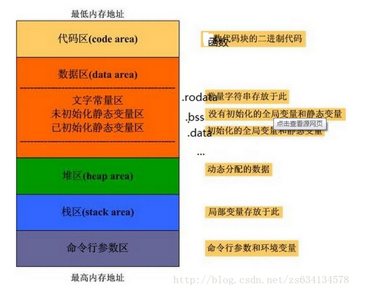

# 编程语言(C/C++)


---

# 目录

| Chapter 1 |Chapter 2| Chapter 3 | Chapter 4| Chapter 5 | 
| :---------: | :---------: | :---------: | :---------: | :---------: | 
| [编程基础](base)|[C++11](#C++11)|[面向对象基础](#oop)|[标准模板库](#stl)|[编译及调试](#other)|

---

# 内容

### <span id = "base">编程基础</span>

C/C++的内容又多又杂，常常看到有人罗列相关书单，觉得毫无意义，我不相信他们真的完全掌握了其中任何一本。学习任何东西，首先要掌握基本概念，基础不牢地动山摇，因为高级的内容都是通过低级的概念来描述的。当基本概念都没理解透，学习再多都是空中楼阁。这里罗列了一些听基本的问题，虽然看着不难，但是精确理解每句话中的每个词真的并不容易。

1. 变量声明和定义区别？
    - 声明仅仅是把变量的声明的位置及类型提供给编译器，并不分配内存空间；定义要在定义的地方为其分配存储空间。
   
    - 相同变量可以再多处声明（外部变量extern），但只能在一处定义。

1. extern关键字
	- extern可以置于变量或者函数前，以标示变量或者函数的定义在别的文件中，提示编译器遇到此变量和函数时在其他模块中寻找其定义。

	- 当它与"C"一起连用时，如: extern "C" void fun(int a, int b);主要是解决在C++代码中调用C代码。告诉编译器，被extern "C"修饰的变量和函数，按照C语言方式编译和链接。
		- C++ 中函数 void print(int i),编译为 _print_int。C中直接编译为_print

1. 函数传参有几种方式？传引用和指针有什么区别呢？
	- 传值：形参是实参的拷贝，改变形参的值并不会影响外部实参的值。从被调用函数的角度来说，值传递是单向的（实参->形参），参数的值只能传入，不能传出。

	- 传指针：形参为指向实参地址的指针，当对形参的指向操作时，就相当于对实参本身进行的操作

	- 传引用：形参相当于是实参的“别名”，对形参的操作其实就是对实参的操作，在引用传递过程中，被调函数的形式参数虽然也作为局部变量在栈中开辟了内存空间，但是这时存放的是由主调函数放进来的实参变量的地址。被调函数对形参的任何操作都被处理成间接寻址，即通过栈中存放的地址访问主调函数中的实参变量。

	- 传指针和传引用区别：主要是指针和引用的区别。首先语法就不一样，指针要取值需要能*ptr，引用可以直接取； 另外传进来的指针可以指向其他位置，但是引用只能绑定在传进来的固定的值上。

2. "零值比较"？
    - bool类型：if(flag)
    
    - int类型：if(flag == 0)
    
    - 指针类型：if(flag == nullptr)
    
    - float类型：if((flag >= -0.000001) && (flag <= 0. 000001))

3. strlen和sizeof区别？
    - sizeof是运算符，并不是函数，结果在编译时得到而非运行中获得；strlen是字符处理的库函数。
    
    - sizeof参数可以是任何数据的类型或者数据（sizeof参数不退化）；strlen的参数只能是字符指针且结尾是'\0'的字符串。

    - **因为sizeof值在编译时确定，所以不能用来得到动态分配（运行时分配）存储空间的大小。**

4. 同一类的不同对象可以互相赋值吗？
    - 可以，但含有指针成员时需要注意。
    
    - 对比类的对象赋值时深拷贝和浅拷贝。

5. 为什么要对齐？结构体内存对齐问题？

	- 如果不按照平台要求对数据存放进行对齐，会带来存取效率上的损失。比如32位的Intel处理器通过总线访问(包括读和写)内存数据。每个总线周期从偶地址开始访问32位内存数据，内存数据以字节为单位存放。如果一个32位的数据没有存放在4字节整除的内存地址处，那么处理器就需要2个总线周期对其进行访问，显然访问效率下降很多。

    - 结构体内成员按照声明顺序存储，第一个成员地址和整个结构体地址相同。

	- 结构体变量中成员的偏移量必须是成员大小的整数倍（0被认为是任何数的整数倍）。

    - 结构体大小必须是所有成员大小的整数倍。

6. static作用是什么？在C和C++中有何区别？
    - static可以修饰局部变量（静态局部变量）、全局变量（静态全局变量）和函数，被修饰的变量存储位置在静态区。对于静态局部变量，相对于一般局部变量其生命周期延长，直到程序运行结束而非函数调用结束，且只在第一次被调用时定义；对于静态全局变量，相对于全局变量其可见范围被缩小，只能在本文件中可见；修饰函数时作用和修饰全局变量相同，都是为了限定访问域。

    - C++的static除了上述两种用途，还可以修饰类成员（静态成员变量和静态成员函数），静态成员变量和静态成员函数不属于任何一个对象，是所有类实例所共有。

    - static的数据记忆性可以满足函数在不同调用期的通信，也可以满足同一个类的多个实例间的通信。

    - 未初始化时，static变量默认值为0。

6. const的作用
	- 修饰普通变量: 该变量值不可更改。顶层/底层const

	- 修饰函数参数: 函数形参声明加const保护某些值在操作过程中不会改变

	- 修饰返回值：表明返回的数据是不可修改的

	- 修饰成员函数: 类的成员函数加上const限定可以声明此函数不会更改类对象的内容

7. 结构体和类的区别？
    - 结构体的默认限定符是public；类是private。
    
    - ~~结构体不可以继承，类可以。~~ C++中结构体也可以继承。

8. malloc和new的区别？
    - malloc和free是标准库函数，支持覆盖；new和delete是运算符，并且支持重载。
    
    - malloc仅仅分配内存空间，free仅仅回收空间，不具备调用构造函数和析构函数功能，用malloc分配空间存储类的对象存在风险；new和delete除了分配回收功能外，还会调用构造函数和析构函数。
    
    - 分配成功时：malloc返回的是void类型指针（必须进行类型转换），new返回的是具体类型指针。

	- 分配失败时：malloc返回NULL，new默认抛出异常。

9. 指针和引用区别？
    - 引用只是别名，不占用具体存储空间，只有声明没有定义；指针是具体变量，需要占用存储空间。
    
    - 引用在声明时必须初始化为另一变量，一旦出现必须为typename refname =  &varname形式；指针声明和定义可以分开，可以先只声明指针变量而不初始化，等用到时再指向具体变量。
    
    - 引用一旦初始化之后就不可以再改变（变量可以被引用为多次，但引用只能作为一个变量引用）；指针变量可以重新指向别的变量。
    
    - 不存在指向空值的引用，必须有具体实体；但是存在指向空值的指针。

10. 宏定义和函数有何区别？
    - 宏在编译时完成替换，之后被替换的文本参与编译，相当于直接插入了代码，运行时不存在函数调用，执行起来更快；函数调用在运行时需要跳转到具体调用函数。
    
    - 宏定义没有返回值；函数调用具有返回值。
    
    - 宏定义参数没有类型，不进行类型检查；函数参数具有类型，需要检查类型。

13. 宏定义和内联函数(inline)区别？
    - 在使用时，宏只做简单字符串替换（编译前）。而内联函数可以进行参数类型检查（编译时），且具有返回值。
    
    - 内联函数本身是函数，强调函数特性，具有重载等功能。
    
    - 内联函数可以作为某个类的成员函数，这样可以使用类的保护成员和私有成员。而当一个表达式涉及到类保护成员或私有成员时，宏就不能实现了。

11. 宏定义和const全局变量的区别？
    - 宏替换发生在预编译阶段，属于文本插入替换；const作用发生于编译过程中。
    
    - 宏不检查类型；const会检查数据类型。
    
    - 宏定义的数据没有分配内存空间，只是插入替换掉；const变量分配内存空间。
    
    - 宏不是语句，不在最后加分号；

12. 宏定义和typedef区别？
    - 宏主要用于定义常量及书写复杂的内容；typedef主要用于定义类型别名。
    
    - 宏替换发生在编译阶段之前，属于文本插入替换；typedef是编译的一部分。
    
    - 宏不检查类型；typedef会检查数据类型。
    
    - 宏不是语句，不在最后加分号；typedef是语句，要加分号标识结束。
    
    - 注意对指针的操作，```typedef (char*) p_char```和```#define p_char char*```在使用起来区别巨大。

14. 条件编译#ifdef, #else, #endif作用？
    - 可以通过加#define，并通过#ifdef来判断，将某些具体模块包括进要编译的内容。
    
    - 用于子程序前加#define DEBUG用于程序调试。
    
    - 应对硬件的设置（机器类型等）。
    
    - 条件编译功能if也可实现，但条件编译可以减少被编译语句，从而减少目标程序大小。

15. 区别以下几种变量？

        const int a;
        int const a;
        const int *a;
        int *const a;

    - int const a和const int a均表示定义常量类型a。
    
    - ``` const int *a```，其中a为指向int型变量的指针，const在 \* 左侧，表示a指向不可变常量。(看成 ```const (*a)``` ，对a指向的对象加const，底层const)
    
    - int *const a，依旧是指针类型，表示a为指向整型数据的常指针。(看成const(a)，对指针const，顶层const)

16. volatile有什么作用？
    - volatile定义变量的值是易变的，每次用到这个变量的值的时候都要去重新读取这个变量的值，而不是读寄存器内的备份。
    
    - 多线程中被几个任务共享的变量需要定义为volatile类型。

17. 什么是常引用？
    - 常引用可以理解为常量指针，形式为const typename & refname = varname。
    
    - 常引用下，原变量值不会被别名所修改。
    
    - 原变量的值可以通过原名修改。
    
    - 常引用通常用作只读变量别名或是形参传递。

18. 区别以下指针类型？

        int *p[10]
        int (*p)[10]
        int *p(int)
        int (*p)(int)

    - int *p[10]表示指针数组，强调数组概念，是一个数组变量，数组大小为10，数组内每个元素都是指向int类型的指针变量。
    
    - int (*p)[10]表示数组指针，强调是指针，只有一个变量，是指针类型，不过指向的是一个int类型的数组，这个数组大小是10。
    
    - int *p(int)是函数声明，函数名是p，参数是int类型的，返回值是int *类型的。
    
    - int (*p)(int)是函数指针，强调是指针，该指针指向的函数具有int类型参数，并且返回值是int类型的。

19. 常量指针和指针常量区别？
    - 常量指针是一个指针，读成常量的指针，指向一个只读变量。如int const *p或const int *p。
    
    - 指针常量是一个不能给改变指向的指针。如int *const p。

20. a和&a有什么区别？

        假设数组int a[10];
        int (*p)[10] = &a;

    - a是数组名，是数组首元素地址，+1表示地址值加上一个int类型的大小，如果a的值是0x00000001，加1操作后变为0x00000005。*(a + 1) = a[1]。
    
    - &a是数组的指针，其类型为int (*)[10]（就是前面提到的数组指针），其加1时，系统会认为是数组首地址加上整个数组的偏移（10个int型变量），值为数组a尾元素后一个元素的地址。
    
    - 若(int *)p ，此时输出 *p时，其值为a[0]的值，因为被转为int *类型，解引用时按照int类型大小来读取。

21. 数组名和指针（这里为指向数组首元素的指针）区别？
    - 二者均可通过增减偏移量来访问数组中的元素。

    - 数组名不是真正意义上的指针，可以理解为常指针，所以数组名没有自增、自减等操作。
    
    - 当数组名当做形参传递给调用函数后，就失去了原有特性，退化成一般指针，多了自增、自减操作，但sizeof运算符不能再得到原数组的大小了。

22. 野指针是什么？
    - 也叫空悬指针，不是指向null的指针，是指向垃圾内存的指针。
    
    - 产生原因及解决办法：
         - 指针变量未及时初始化 => 定义指针变量及时初始化，要么置空。
    
         - 指针free或delete之后没有及时置空 => 释放操作后立即置空。

23. 堆和栈的区别？

    - 申请方式不同。

        - 栈由系统自动分配。

        - 堆由程序员手动分配。

    - 申请大小限制不同。

        - 栈顶和栈底是之前预设好的，大小固定，可以通过ulimit -a查看，由ulimit -s修改。

        - 堆向高地址扩展，是不连续的内存区域，大小可以灵活调整。

    - 申请效率不同。

        - 栈由系统分配，速度快，不会有碎片。

        - 堆由程序员分配，速度慢，且会有碎片。

24. delete和delete[]区别？

    - delete只会调用一次析构函数。

    - delete[]会调用数组中每个元素的析构函数。

24. char *p = new char[32];
	1. 如果用delete p，会发生什么?
		- 因为char是基本数据类型没有析构函数，而系统也记忆了内存大小。所以用delete不会造成内存泄露。但是这种方法在C++标准里是未定义行为，要避免使用。

	2. 如果用malloc和free怎么申请和释放32个字节的buffer。
		- char *ptr = (char*)malloc(32);free(ptr);ptr = nullptr;

	3. 如果用free(p) 可以吗？
		- 这是未定义行为。但是对于基本数据类型是可以使用的。

	4. 为什么delete []就可以删除整个数组。
		- 因为系统分配额外空间记录数组大小。具体来说是在p指针附近(下个位置)存储了指针指向物体的大小的信息

24. 模板的优点和缺点

    - 优点：
    	- 代码复用。
    	- 模板类更加的安全，因其参数类型在编译时都是已知的。

    -  缺点：
    	- 模板必须在头文件中，这样一旦有所变更需要重编译所有相关工程；同时也没有信息隐藏。
    	- 一些编译器对template支持不好。
    	- 模板对每种类型生成额外的代码，可能导致代码膨胀。

24. 模板的特化与偏特化
	- 全特化就是限定死模板实现的具体类型，偏特化就是如果这个模板有多个类型，那么只限定其中的一部分。

28. c++中内存分配
	
    -虚函数表储存在全局常量区
	- ps:new分配的自由存储区，这是一个C++抽象的概念，不是具体虚拟内存的位置。




### <span id = "C++11">C++11 新特性</span>

1. 了解C++11的哪些新特性?
	1. 易用性:nullptr / auto / 范围for循环 / 初始化列表 / override和final / lambda表达式

	2. 右值引用和移动语义

	3. 智能指针

	4. 标准库扩充,新增array/forward_list/两个unordered/tuple新容器,语言级线程支持,thread/mutex/unique_lock等

25. C++四种类型转换：static_cast, dynamic_cast, const_cast, reinterpret_cast

	1. const_cast用于将const变量转为非const

	2. static_cast用的最多，对于各种隐式转换，非const转const，void*转指针等, static_cast能用于多态向上转化，如果向下转能成功但是不安全，结果未知；

	3. dynamic_cast用于动态类型转换。只能用于含有虚函数的类，用于类层次间的向上和向下转化。只能转指针或引用。向下转化时，如果是非法的对于指针返回NULL，对于引用抛异常。要深入了解内部转换的原理。

	4. reinterpret_cast，将数据的二进制形式重新解释，但是不改变其值。几乎什么都可以转，比如将int转指针，可能会出问题，尽量少用；

25. 四种智能指针
	- shared_ptr, 共享所有权,允许多个指针指向同一个对象,其内部有一个关联的引用计数,用来记录有多少个其他的shared_ptr指向相同的对象,当引用计数为0时将调用析构函数释放对应空间。
	- unique_ptr遵循独占语义,在任何时间点,资源只能唯一地被一个unique_ptr占有,当其离开作用域,所包含的资源被释放。
	- weak_ptr解决shared_ptr循环引用时的bug。
	- auto_ptr常常会导致野指针，不能指向一组对象，不支持标准容器。所以在C++11被废弃了。

26. 函数对象
	- 如果类重载了函数调用运算符，则我们可以像使用函数一样使用该类的对象。因为这样的类同时也能储存状态，所以与普通函数相比，它们更加灵活。```cpp  int operator() (int val) const```

27. lambda

28. override
	- 明确地表示一个函数是对基类中一个虚函数的override。编译器也知道它是一个override，它会检查基类虚函数和派生类中重载函数的签名不匹配问题。如果签名不匹配，编译器会发出错误信息。

29. final
	- final有两个用途。第一，它阻止了从类继承；第二，阻止一个虚函数的override。

30. dynamic_cast如何实现
	- 编译器会在每个含有虚函数的类的虚函数表的前四个字节存放一个指向_RTTICompleteObjectLocator结构的指针，当然还要额外空间存放_RTTICompleteObjectLocator及其相关结构的数据。里面存放了vptr相对this指针的偏移，构造函数偏移（针对虚拟继承），type_info指针，以及类层次结构中其它类的相关信息。如果是多重继承，这些信息更加复杂。


### <span id = "oop">面向对象基础</span>

能够准确理解下面这些问题是从C程序员向C++程序员进阶的基础。当然了，这只是一部分。

1. 面向对象三大特性？

    - 封装性：数据和代码捆绑在一起，避免外界干扰和不确定性访问。
    
    - 继承性：让某种类型对象获得另一个类型对象的属性和方法。
    
    - 多态性：同一事物表现出不同事物的能力，即向不同对象发送同一消息，不同的对象在接收时会产生不同的行为（重载实现编译时多态，虚函数实现运行时多态）。

2. public/protected/private的区别？
    - public的变量和函数在类的内部外部都可以访问。
    
    - protected的变量和函数只能在类的内部和其派生类中访问。
    
    - private修饰的元素只能在类内访问。

3. 对象存储空间？
    - 非静态成员的数据类型大小之和。
    
    - 编译器加入的额外成员变量（如指向虚函数的指针）。
    
    - 为了边缘对齐优化加入的padding。

4. C++空类有哪些成员函数?
    - 首先，空类对象大小为1字节。
    
    - 默认函数有：
        - 构造函数 A();
    
        - 析构函数 ~A(void);
    
        - 拷贝构造函数 A(const A &a);
    
        - 赋值运算符 A& operate =(const A &a);

5. 构造函数能否为虚函数，析构函数呢？
    - 析构函数：
        - 析构函数可以为虚函数，并且一般情况下基类析构函数要定义为虚函数。
    
        - 只有在基类析构函数定义为虚函数时，调用操作符delete销毁指向对象的基类指针时，才能准确调用派生类的析构函数（从该级向上按序调用虚函数），才能准确销毁数据。
    
        - 析构函数可以是纯虚函数，含有纯虚函数的类是抽象类，此时不能被实例化。但派生类中可以根据自身需求重新改写基类中的纯虚函数。
    
    - 构造函数：
        - 构造函数不能定义为虚函数。虚函数对应一个vtable，可是这个vtable其实是存储在对象的内存空间的。问题出来了，如果构造函数是虚的，就需要通过 vtable来调用，可是对象还没有实例化，也就是内存空间还没有，怎么找vtable呢？所以构造函数不能是虚函数。

6. 构造函数和析构函数能否调用虚函数？
	
    - 从语法上讲，调用完全没有问题。但是从效果上看，往往不能达到需要的目的。
    - 假设一个基类A的构造函数中调用了一个虚函数。派生类B继承自A 。当用构造函数创建一个B类对象时，先调用基类A的构造函数，而此时编译器认为正在创建的对象的类型是A，所以虚函数是A类的虚函数。析构时同理，派生类成员先被析构了，当进入基类的析构函数时，就认为对象是基类对象调用基类的虚函数。

6. 构造函数调用顺序，析构函数呢？
    - 第1 基类的构造函数：如果有多个基类，先调用纵向上最上层基类构造函数，如果横向继承了多个类，调用顺序为派生表从左到右顺序。
    
    - 第2 成员类对象的构造函数：如果类的变量中包含其他类（类的组合），需要在调用本类构造函数前先调用成员类对象的构造函数，调用顺序遵照在类中被声明的顺序。
    
    - 第3 派生类的构造函数。
    
    - 第4 析构函数与之相反。

7. 拷贝构造函数中深拷贝和浅拷贝区别？
    - 深拷贝时，当被拷贝对象存在动态分配的存储空间时，需要先动态申请一块存储空间，然后逐字节拷贝内容。
    
    - 浅拷贝仅仅是拷贝指针字面值。
    
    - 当使用浅拷贝时，如果原来的对象调用析构函数释放掉指针所指向的数据，则会产生空悬指针。因为所指向的内存空间已经被释放了。

8. 拷贝构造函数和赋值运算符重载的区别？
    - 拷贝构造函数是函数，赋值运算符是运算符重载。
    
    - 拷贝构造函数会生成新的类对象，赋值运算符不能。
    
    - 拷贝构造函数是直接构造一个新的类对象，所以在初始化对象前不需要检查源对象和新建对象是否相同；赋值运算符需要上述操作并提供两套不同的复制策略，另外赋值运算符中如果被赋值对象有内存分配则需要先把内存释放掉。
    
    - 形参传递是调用拷贝构造函数（调用的被赋值对象的拷贝构造函数），但并不是所有出现"="的地方都是使用赋值运算符，如下：

            Student s;
            Student s1 = 2;    // 调用拷贝构造函数
            Student s2;
            s2 = s;    // 赋值运算符操作

    **注：类中有指针变量指向动态分配的内存资源时，要重写析构函数、拷贝构造函数和赋值运算符**

8. 拷贝构造函数在什么时候会被调用？
	- 假设Person是一个类。
		1. Person p(q)   //使用拷贝构造函数来创建实例p;
		2. Person p = q; //使用拷贝构造函数来定义实例p时初始化p
		3. f(p) //p参数进行值传递时，会调用复制构造函数创建一个局部对象

9. 虚函数和纯虚函数区别？
    - 虚函数是为了实现动态编联产生的，目的是通过基类类型的指针指向不同对象时，自动调用相应的、和基类同名的函数（使用同一种调用形式，既能调用派生类又能调用基类的同名函数）。虚函数需要在基类中加上virtual修饰符修饰，因为virtual会被隐式继承，所以子类中相同函数都是虚函数。当一个成员函数被声明为虚函数之后，其派生类中同名函数自动成为虚函数，在派生类中重新定义此函数时要求函数名、返回值类型、参数个数和类型全部与基类函数相同。
    
    - 纯虚函数只是相当于一个接口名，含有纯虚函数的类不能够实例化。

9. 虚函数机制带来的开销有哪些?

	- 主要是虚表的存储开销、函数通过指针使用带来的时间开销。

10. 覆盖、重载和隐藏的区别？
     - override 覆盖（也叫重写）是派生类中重新定义父类的虚函数，其函数名、参数列表（个数、类型和顺序）、返回值类型和父类完全相同，只有函数体有区别。派生类虽然继承了基类的同名函数，但用派生类对象调用该函数时会根据对象类型调用相应的函数。覆盖只能发生在类的成员函数中。
    
     - overwrite 隐藏是指派生类函数屏蔽了与其同名的函数，这里仅要求基类和派生类函数同名即可。其他状态同覆盖。可以说隐藏比覆盖涵盖的范围更宽泛，毕竟参数不加限定。
    
     - overload 重载是具有相同函数名但参数列表不同（个数、类型或顺序）的两个函数（不关心返回值），当调用函数时根据传递的参数列表来确定具体调用哪个函数。重载可以是同一个类的成员函数也可以是类外函数。

11. 在main执行之前执行的代码可能是什么？

    - 全局对象的构造函数。

12. 哪几种情况必须用到初始化成员列表？

    - 类中有const成员。

    - 类中有reference成员。

    - 调用一个基类的构造函数，而该函数有一组参数。

    - 调用一个数据成员对象的构造函数，而该函数有一组参数。

13. 什么是虚指针？

    - 虚指针或虚函数指针是虚函数的实现细节。

    - 虚指针指向虚表结构。

14. 重载和函数模板的区别？

    - 重载需要多个函数，这些函数彼此之间函数名相同，但参数列表中参数数量和类型不同。在区分各个重载函数时我们并不关心函数体。

    - 模板函数是一个通用函数，函数的类型和形参不直接指定而用虚拟类型来代表。但只适用于参数个数相同而类型不同的函数。

15. this指针是什么？

    - this指针是类的指针，指向对象的首地址。

    - this 实际上是成员函数的一个形参，在调用成员函数时将对象的地址作为实参传递给this。所以this指针只能在成员函数中使用。在静态成员函数中不能用this。

    - this指针只有在成员函数中才有定义，且存储位置会因编译器不同有不同存储位置。

16. 类模板是什么？

    - 用于解决多个功能相同、数据类型不同的类需要重复定义的问题。

    - 在建立类时候使用template及任意类型标识符T，之后在建立类对象时，会指定实际的类型，这样才会是一个实际的对象。

    - 类模板是对一批仅数据成员类型不同的类的抽象，只要为这一批类创建一个类模板，即给出一套程序代码，就可以用来生成具体的类。

17. 构造函数和析构函数调用时机？

    - 全局范围中的对象：构造函数在所有函数调用之前执行，在主函数执行完调用析构函数。

    - 局部自动对象：建立对象时调用构造函数，函数结束时调用析构函数。

    - 动态分配的对象：建立对象时调用构造函数，调用释放时调用析构函数。

    - 静态局部变量对象：建立时调用一次构造函数，主函数结束时调用析构函数。

18. delete this

	- 类的成员函数中能不能调用delete this？

         可以。假设一个成员函数release，调用了delete this。那么这个对象在调用release方法后，还可以进行其他操作，比如调用其他方法。前提是：被调用的方法不涉及这个对象的数据成员和虚函数，否则会出现不可预期的问题。
	
	- 为什么是不可预期的问题？

         这涉及到操作系统的内存管理策略。delete this释放了类对象的内存空间，但是内存空间却并不是马上被回收到系统中，可能是缓冲或者其他什么原因，导致这段内存空间暂时并没有被系统收回。但是其中的值是不确定的。

	- 类的析构函数中调用delete this，会发生什么？

         导致栈溢出。delete的本质是为将被释放的内存调用一个或多个析构函数，然后，释放内存。显然，delete this会去调用本对象的析构函数，而析构函数中又调用delete this，形成无限递归，造成堆栈溢出，系统崩溃。

19. 当把一个派生类对象指针赋值给其基类指针时会发生什么样的行为

	- 当使用基类的指针指向一个派生类的对象时，编译器会安插相应的代码，调整指针的指向，使基类的指针指向派生类对象中其对应的基类子对象的起始处。

19. 在类的构造函数里面直接使用  **memset(this,0,sizeof(*this))** 来初始化整个类里会发生什么？

	- 将所有非静态成员变量置0。当有虚函数的时候，虚函数表指针vptr会被置成空。


19. 多继承有什么问题？
	- 多继承比单继承复杂，引入了歧义的问题（ 如果基类的成员函数名称相同，匹配度相同, 则会造成歧义）

	- 菱形的多继承，导致虚继承的必要性；但虚继承在大小、速度、初始化/赋值的复杂性上有不小的代价，当虚基类中没有数据时还是比较合适的。


21. 析构函数能抛出异常吗？

	- 不能，也不应该抛出。

	- 如果析构函数抛出异常，则异常点之后的程序不会执行，如果析构函数在异常点之后执行了某些必要的动作比如释放某些资源，则这些动作不会执行，会造成诸如资源泄漏的问题。

	- 通常异常发生时，c++的机制会调用已经构造对象的析构函数来释放资源，此时若析构函数本身也抛出异常，则前一个异常尚未处理，又有新的异常，会造成程序崩溃的问题。

22. 为什么内联函数，构造函数，静态成员函数不能为virtual函数

    - 内联函数

    内联函数是在编译时期展开,而虚函数的特性是运行时才动态联编,所以两者矛盾,不能定义内联函数为虚函数。

    - 构造函数

    构造函数用来创建一个新的对象,而虚函数的运行是建立在对象的基础上,在构造函数执行时,对象尚未形成,所以不能将构造函数定义为虚函数

    - 静态成员函数

    静态成员函数属于一个类而非某一对象,没有this指针,它无法进行对象的判别。

    - 友元函数

    C++不支持友元函数的继承，对于没有继承性的函数没有虚函数 

23. 如何定义一个只能在堆上生成对象的类?
	
    - 只能在堆上，析构函数设为protected。编译器在为类对象分配栈空间时，会先检查类的析构函数的访问性，其实不光是析构函数，只要是非静态的函数，编译器都会进行检查。如果类的析构函数是私有的，则编译器不会在栈空间上为类对象分配内存。
    - 类中必须提供一个destroy函数，调用delete this，来进行内存空间的释放。类对象使用完成后，必须调用destroy函数。
    - 用new建立对象，destroy销毁对象很奇怪。可以用一个静态成员函数将new封装起来。同时将构造函数设为protected。
```cpp
class A{
protected:
	A(){};
    ~A(){};
public:
	static A* create(){
    	return new A();
    }
    void destroy(){
    	delete this;
    }
};
```

24. 如何定义一个只能在栈上生成对象的类？
	
    - 只有使用new运算符，对象才会建立在堆上，因此，只要禁用new运算符就可以实现类对象只能建立在栈上。将operator new()设为私有即可。
```cpp
class A{
public:
	A(){};
    ~A(){};
private:
	 void * operator  new ( size_t  t){}      // 注意函数的第一个参数和返回值都是固定的
      void  operator  delete ( void * ptr){}  // 重载了new就需要重载delete
};
```


---
### <span id = "stl">标准模板库</span>

STL内容虽然看起来很多，单独成书都不是问题（《STL源码剖析》），但从实际使用状况来看，我认为只需要知道以下几点就可以了：

- 怎么用？

    各种STL基本的增删改查怎么使用。每种容器都提供了很多操作，但实际增删改查我们通常只需要掌握透彻一种方式即可。有些功能只是出于通用性考虑才存在的，但对于相应的STL这些操作完全可以忽略。所以我对STL使用的看法是，不需要花太多时间去了解所有功能，只要掌握最基本的即可，要把精力放在对需求的了解并选择适合的数据结构。

- 怎么实现？

    本身STL就是封装了我们常用的数据结构，所以最先需要了解每种数据结构的特性。而且了解实现方式对我们能够准确、高效使用STL打下了基础。

- 如何避免错误？

    在第二阶段了解了STL的实现之后，我们已经可以很清楚地知道他们底层使用的是什么数据结构以及该数据结构做什么操作比较高效。但还有一点需要注意的就是怎么才能用对他们，避免一些未知的错误，比如迭代器失效问题。

**string**


**vector**

用法：

        定义：
            vector<T> vec;

        插入元素：
            vec.push_back(element);
            vec.insert(iterator, element);

        删除元素：
            vec.pop_back();
            vec.erase(iterator);

        修改元素：
            vec[position] = element;

        遍历容器：
            for(auto it = vec.begin(); it != vec.end(); ++it) {......}

        其他：
            vec.empty();    //判断是否空
            vec.size();    // 实际元素
            vec.capacity();    // 容器容量
            vec.begin();    // 获得首迭代器
            vec.end();    // 获得尾迭代器
            vec.clear();    // 清空

实现：

[模拟Vector实现](https://github.com/linw7/Skill-Tree/blob/master/code/my_vector.cpp)

- 线性表，数组实现。
    - 支持随机访问。
    
    - 插入删除操作需要大量移动数据。

- 需要连续的物理存储空间。

- 每当大小不够时，重新分配内存（*2），并复制原内容。

错误避免：

[迭代器失效](https://github.com/linw7/Skill-Tree/blob/master/code/vector_iterator.cpp)

- 插入元素
    - 尾后插入：size < capacity时，首迭代器不失效尾迭代失效（未重新分配空间），size == capacity时，所有迭代器均失效（需要重新分配空间）。
    
    - 中间插入：size < capacity时，首迭代器不失效但插入元素之后所有迭代器失效，size == capacity时，所有迭代器均失效。

- 删除元素
    - 尾后删除：只有尾迭代失效。
    
    - 中间删除：删除位置之后所有迭代失效。

**map**

用法：

        定义：
            mao<T_key, T_value> map;

        插入元素：
            map.insert(pair<T_key, T_value>(key, value));    // 同key不插入
            map.insert(map<T_key, T_value>::value_type(key, value));    // 同key不插入
            map[key] = value;    // 同key覆盖

        删除元素：
            map.erase(key);    // 按值删
            map.erase(iterator);    // 按迭代器删

        修改元素：
            map[key] = new_value;

        遍历容器：
              for(auto it = vec.begin(); it != vec.end(); ++it) {......}

实现：

[RBTree实现](https://github.com/linw7/Skill-Tree/tree/master/code/RBTree)

- 树状结构，RBTree实现。
    - 插入删除不需要数据复制。
    
    - 操作复杂度仅跟树高有关。

- RBTree本身也是二叉排序树的一种，key值有序，且唯一。
    - 必须保证key可排序。

基于红黑树实现的map结构（实际上是map, set, multimap，multiset底层均是红黑树），不仅增删数据时不需要移动数据，其所有操作都可以在O(logn)时间范围内完成。另外，基于红黑树的map在通过迭代器遍历时，得到的是key按序排列后的结果，这点特性在很多操作中非常方便。

面试时候现场写红黑树代码的概率几乎为0，但是红黑树一些基本概念还是需要掌握的。

1. 它是二叉排序树（继承二叉排序树特显）：
    - 若左子树不空，则左子树上所有结点的值均小于或等于它的根结点的值。

    - 若右子树不空，则右子树上所有结点的值均大于或等于它的根结点的值。

    - 左、右子树也分别为二叉排序树。

2. 它满足如下几点要求：
    - 树中所有节点非红即黑。

    - 根节点必为黑节点。

    - 红节点的子节点必为黑（黑节点子节点可为黑）。

    - 从根到NULL的任何路径上黑结点数相同。

3. 查找时间一定可以控制在O(logn)。

4. 红黑树的节点定义如下：
    ```C++
    enum Color {
        RED = 0,
        BLACK = 1
    };
    struct RBTreeNode {
        struct RBTreeNode*left, *right, *parent;
        int key;
        int data;
        Color color;
    };
    ```
    
所以对红黑树的操作需要满足两点：1.满足二叉排序树的要求；2.满足红黑树自身要求。通常在找到节点通过和根节点比较找到插入位置之后，还需要结合红黑树自身限制条件对子树进行左旋和右旋。

相比于AVL树，红黑树平衡性要稍微差一些，不过创建红黑树时所需的旋转操作也会少很多。相比于最简单的BST，BST最差情况下查找的时间复杂度会上升至O(n)，而红黑树最坏情况下查找效率依旧是O(logn)。所以说红黑树之所以能够在STL及Linux内核中被广泛应用就是因为其折中了两种方案，既减少了树高，又减少了建树时旋转的次数。

从红黑树的定义来看，红黑树从根到NULL的每条路径拥有相同的黑节点数（假设为n），所以最短的路径长度为n（全为黑节点情况）。因为红节点不能连续出现，所以路径最长的情况就是插入最多的红色节点，在黑节点数一致的情况下，最可观的情况就是黑红黑红排列......最长路径不会大于2n，这里路径长就是树高。


**set**

---

