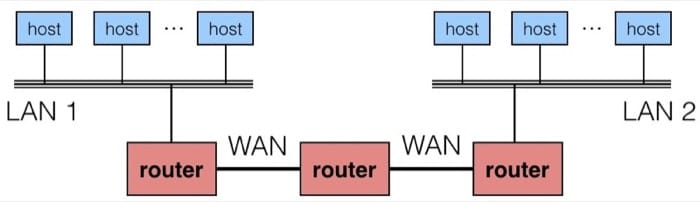

#网络编程

####网络

- 局域网（LAN）：常使用以太网技术。

	- 每个主机通过网络配适器接入网络。每个以太网配适器，都有全球唯一的48位的地址。

	- 以太网段：主机通过集线器（hub）连接在一起。集线器的功能是不加分辨地将从一个端口上收到的位复制到其他所有的端口上。

	- 以太桥接网：网桥会利用一种聪明的分配算法，自动学习哪个主机可以通过哪个端口到达。在必要时，将帧从一个端口复制到另一个（不是群发）。

- 广域网（WAN）：不同的（也许不兼容）的 LAN 可以通过 router 来进行物理上的连接，这样连接起来的网络称为 internet。

- 互联网包：包头和有效荷载。

- 帧：帧头和有效荷载组成。

- ip地址 

- 因特网

套接字：
套接字接口函数
配合函数
套接字接口的辅助函数

万维网（WWW）

HTTP，超文本传输协议

静态内容：
GET http://www.cmu.edu/hub/index.html HTTP/1.1
GET /hub/index.html HTTP/1.0 -> www.cmu.edu

动态内容：
GET http://bluefish.ics.cs.cmu.edu:8000/cgi-bin/adder?15000&213 HTTP/1.1
GET /cgi-bin/adder?15000&213 HTTP/1.0 -> http://bluefish，ics.cs.cmu.edu:8000

	GET http://www.cmu.edu：80/hub/index.html HTTP/1.1

HTTP请求：请求行 请求报头 空行

	GET /hub/index.html HTTP/1.0
	Host: www.cmu.edu：80
	User-Agent: Mozilla/5.0 (X11; Linux x86_64; rv:10.0.3)
	Gecko/20120305 Firefox/10.0.3
	Connection: close
	Proxy-Connection: close
	空行

___

#####reference

- 《深入理解计算机系统第三版》
- [【不周山之读薄 CSAPP】捌 网络编程 ](http://wdxtub.com/2016/04/16/thin-csapp-8/)
- [winsock2学习篇（一） getaddrinfo()函数的用法](http://www.cnblogs.com/ishore/p/4009205.html)