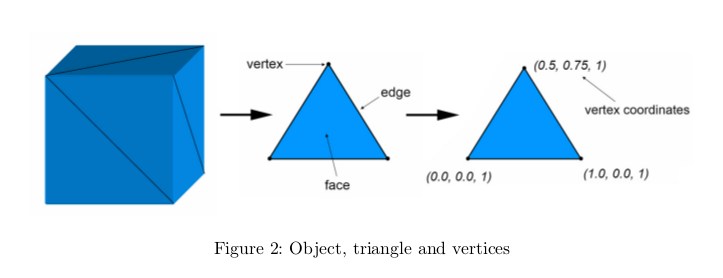
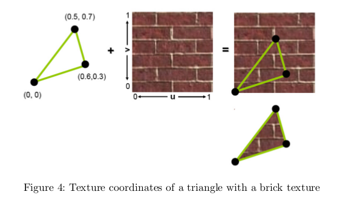
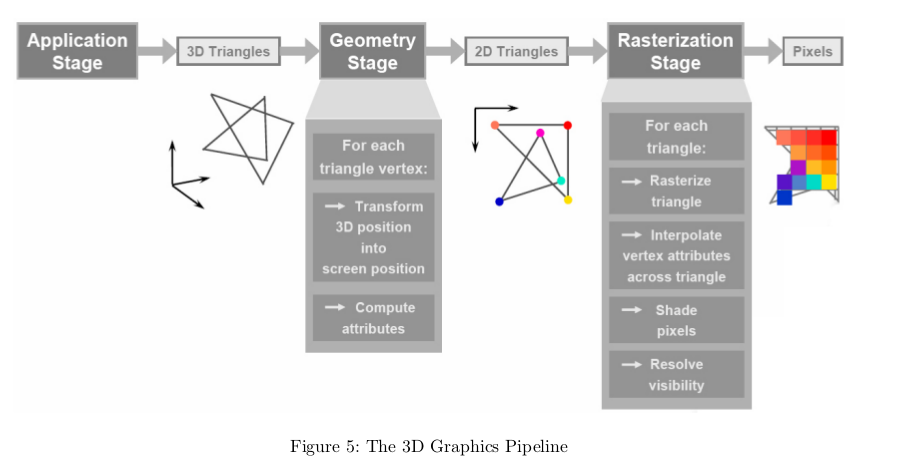
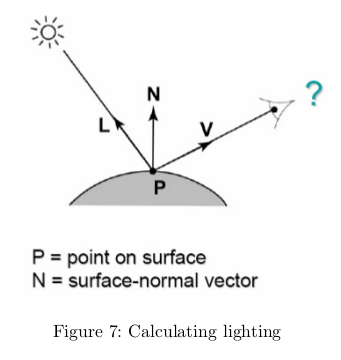
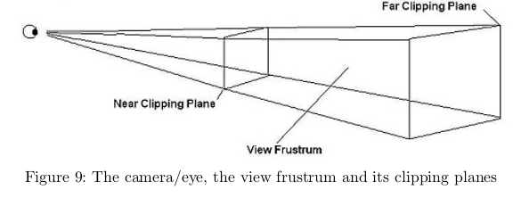
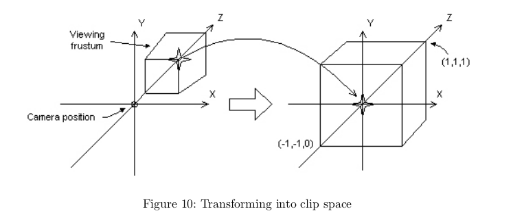
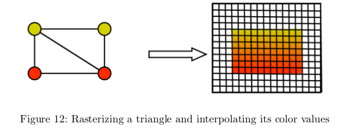

　　渲染管线中一些技术名词的常用翻译比较具有“误导性”，因为大部分是英文直译。所以我得了解一个技术的具体作用，才能知道它到底是什么。这篇文章我主要翻译自Minh Tri Do Dinh的GPUs - Graphics Processing Units一文。也就是一些论坛里推荐给新手阅读的图形处理器架构(GPU_Architecture)与图形管线(Graphics_Pipeline)这篇文章。我已把原文pdf上传：[网盘地址](https://pan.baidu.com/s/1V5NxvfXISMyTSq3xZ1dg)，密码: wpxh

####基础名词
* 3D物体：任何物体，其几何形状都是由三角形组成的。三角形，或者任何图形，都由顶点组成。

* 顶点：具有空间坐标和其他信息（如颜色和纹理坐标）的点

* 纹理：映射到3D物体表面的图像，这会造成该物体由某种材料组成的幻觉。物体的顶点存储着纹理坐标（2维向量），用于指定纹理如何映射到任何给定表面。

* 齐次坐标：3D空间中的点通常需要3个坐标来指定位置。如果继续用3个坐标表示，有时会遇到问题。例如：顶点平移时的操作是加一个向量，顶点旋转时的操作是乘以3x3矩阵）。所以我们通过扩展三维向量来绕开这个问题。我们添加另一个坐标（w坐标，从而得到所谓的齐次坐标[注1]。这样一来，顶点的所有变换都可以通过将其四维坐标与特定的4x4矩阵相乘来进行，使得计算更容易。齐次坐标的另一个用途是明确区分向量和点。

####渲染管线
　　渲染管线（Graphics pipeline/rendering pipeline），其实贴切的翻译应该是渲染流水线。渲染流水线就是将数据从3D场景转换成2D图像，最终在屏幕上显示出来的总过程。它分为几个阶段：应用阶段、几何阶段和光栅阶段。
　　应用阶段：主要是CPU与内存打交道，例如碰撞检测，计算好的数据（顶点坐标、法向量、纹理坐标、纹理）就会通过数据总线传给图形硬件 。

#####几何阶段(Geometry Stage)

　　这个阶段也被称为“变换和光照”阶段。为了从3D场景转换到2D，场景中的所有物体都需要转换到几个空间。每个空间都有自己的坐标系。这些转换是通过一个空间的顶点转换到另一个空间的顶点来实现的。
　　光照（lighting），是这个阶段的另一个主要部分。是使用物体表面的法向量来计算的。通过摄像机的位置和光源的位置，可以计算出给定顶点的光照属性。
  

　　对于坐标系变换，我们从**物体坐标系**开始，每个物体都有自己的坐标系，这有利于几何变换，如平移，旋转和缩放。
　　之后，我们进入到**世界坐标系**，场景中的所有物体都具有统一的坐标系。
　　下一步是转换到视图空间，即**摄像机坐标系**。想象一下：先在世界空间中放一个虚拟摄像机，然后进行坐标变换，使得摄像机位于视图空间的原点，镜头对准z轴的方向。现在我们定义一个所谓的视体（view frustrum），它用来决定了我们能够通过虚拟的3D摄像机所能看到的场景，我们只需要把这些内容渲染出来就行。

　　之后，所有的顶点将被转换**剪切空间**，并通过**图元装配**，组装成**图元**（primitive，三角形或线）。当物体在视体的外，说明我们不需要渲染这个物体，所以就简单丢弃它。当一个物体有部分在视体内，我们需要进行剪切，同时生成新的顶点。新顶点具有适当的的纹理坐标和颜色坐标。
　　接着我们执行透视分割操作，其实就是实现了一个投影变换，把”近大远小“的效果实现出来。把一个视体转换为归一化的立方体。这个立方体的坐标范围：x和y在-1和1之间，z在0和1之间。同时视体内的物体也一同进行缩放。这样一来得到的立方体，便于裁剪操作，也便于将来投影到平面（立方体只需要“扁平化”）。

　　最后，我们转换到**屏幕空间**。执行的操作：根据窗口大小将x和y坐标缩放到合适的坐标，这样就得到2D图片了。（请注意，顶点的z坐标会保留，用于以后的深度操作）
　　请注意，除了剪裁之外纹理坐标也需要进行转换。还要注意除去不可见的表面[注2]。如出去立方体的背面，就是所谓的背面剔除。

####光栅阶段(Rasterization Stage)
　　光栅这个名词不太好理解，新手可以想象成”透过一把梳子看世界“，类似于将连续的数据转化成离散的数据。这里光栅阶段是指矢量图形转化成像素点的过程。
　　GPU需要遍历2D图像并进行转换将数据转化为大量“像素候选”，即所谓的**片段**（Fragment，片段可以理解为像素的原型，但绝对不是指一大片像素）。片段是包含位置，颜色，深度，纹理坐标等属性的数据结构。片段可能会最终成为图像上的像素。片段是通过检查原始图元和和屏幕像素是否相交来生成的。如果一个片段与一个基元相交，但不与它的任何顶点相交，那么它的属性必须通过顶点之间的属性插值来计算得出。

  

　　最后还有一些步骤来得到最终的像素。最终像素颜色的计算：结合纹理和颜色、光照等其他属性，或片段与另一个半透明片段的结合（所谓的α混合），亦或是可选的雾化效果（另一个图形效果）。[注3]

---
注1：齐次坐标和四元数长得很像，但却是不同的概念，适用领域也不一样。

注2：可见性检查的一些具体操作：
* 剪刀测试（检查矩形面罩的可见度）
* 模板测试（类似于剪刀测试，仅针对缓冲区中的任意像素模板）
* 深度测试（比较片段的z坐标，丢弃更远的片段）
* Alpha测试（检查半透明碎片的可见度）

注3：在我们获得最终结果之前，可以应用像抗锯齿这样的附加程序：将一些像素写入内存供以后显示。
####reference
* [GPUs - Graphics Processing Units]()
* [知乎：如何理解 OpenGL 中着色器、渲染管线、光栅化等概念？](https://www.zhihu.com/question/29163054)
* [OpenGL技术之View Volume, Viewport, Screen的关系](https://blog.csdn.net/i_dovelemon/article/details/50830847)
* [维基百科-齐次坐标](https://zh.wikipedia.org/wiki/%E9%BD%90%E6%AC%A1%E5%9D%90%E6%A0%87)
* [坐标系统](https://learnopengl-cn.readthedocs.io/zh/latest/01%20Getting%20started/08%20Coordinate%20Systems/)
