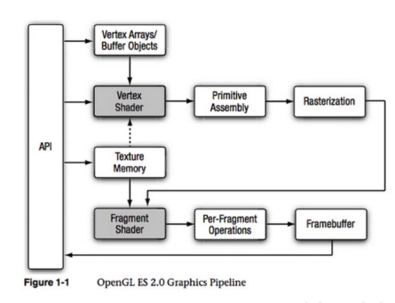

# openGL渲染管线

###实时渲染的一些名词

- 帧数：
  - 23帧，人眼感觉是连续的动画
  - 普通游戏，30帧
  - FPS等操作感强的游戏，60帧
  - VR游戏 75-90帧，每帧两个屏幕

- 2D渲染

  - 场景由2D图片或像素块组成。
  - 通过把一块内存（图片像素数据）往另一块（显示缓冲区）上搬运的方式，实现图片绘制

- 3D渲染
  - 定点数据：
    - 位置坐标数据
    - 颜色数据（可选）
    - 法线数据：代表着顶点的朝向，计算光照时，能知道哪一块光多光少。
    - 骨骼权重数据：将骨骼运动转化成顶点的运动，一个点可能跟随多个骨骼运动。
    - 贴图，UV。UV是指u,v纹理贴图坐标的简称，坐标范围是0到1。它定义了图片上每个点的位置的信息。UV就是2D将图像上每一个点精确对应到3D模型物体的表面。（MipMap：远处的角色自动使用小的贴图）
    - 材质：塑料，布料，皮肤等等。

- 渲染API

  - DirectX：微软的图形编程API。
  - OpenGL：着色语言是OpenGL Shader Language（GLSL）跨编程语言，跨平台。

####OpenGL ES2.0 管线流程
**OpenGL ES 2.0** (OpenGL for Embedded Systems)

1. Vertex Shader，顶点着色器：

   * 顶点变换：移动，旋转，缩放，坐标系转换，投影变换。

   * 光照计算：做法线变换和法线规格化。即顶点位置改变后，法线位置需要跟着改变，然后再做归一化。

   * 纹理坐标转换：修改UV，偏移缩放等。

2. PrimitiveAssembly，图元装配：

   * 支持点、线、三角形三个图元 。三角形需要根据三个顶点装配成一个三角面

   * 对图元裁剪（clip）：保留完全在视锥体里的图元，丢弃完全不在视锥体中的图元，对一半在一半不在的图元进行裁剪。

   * 再对视锥体中的图元进行剔除（cull）：编码来决定：正面剔除或背面剔除还是全剔除。比如有的物体的背面是看不到的，所以需要剔除。但有的物体是透明的，就保留背面。

3. Rasterization，光栅化：把一个矢量三角形变成一个位图图像（填充像素），每个顶点之间会通过颜色数据自动进行插值。

4. Fragment Shader，片段着色器

   * Pre-Fragement Operation，预处理阶段：进行一些片段测试，进一步剔除不必要的信息。

     * Pixel ownership test：测试该像素用户是否可见是否被其他窗口遮挡。

     * Scissors Test：裁剪测试，判断是否在定义的裁剪区域内。

     * Stencil Test：模板测试，决定了像素的颜色值是否要被写入到渲染目标。比如FPS中开狙击镜，只有镜中的区域需要渲染。

     * Depth Test：深度测试。摄像机可见的深度是有范围的，只显示近裁剪面到远裁剪面之间的。剔除深度高的 

     * Blending：混合,对于特殊的材质（比如玻璃等半透明物体，除了玻璃的颜色还需要有其他物体的颜色信息） 

     * Dithering：抖动显示，就是用少量的颜色来表现更广泛的颜色的。

5. Frameduffer：保存最终的渲染数据

###Shader简介

** Shader 就是渲染管线的一部分，并且是可编程的。**
**分别为Vertex Shader和Fragment Shader **

* Vertex Shader：并行，每次对一个点做处理。输入模型上每个顶点，输出投影变换后屏幕坐标系中的顶点。
	* 核心函数：Pos(proj) = MVP * Pos(3D)//M,V,P分别是三个变换矩阵

* 光栅化：从矢量图插值得到一个个像素点。根据窗口大小，得到的像素多少也不一定。

* Fragment Shader：并行。输入光栅化后的单个像素点，输出带颜色的像素点。

	* 核心函数：Color = tex2D(texMain, texcoord) // 输入参数MainTex是贴图， texcoord是光栅化后的u，v坐标。返回颜色。

