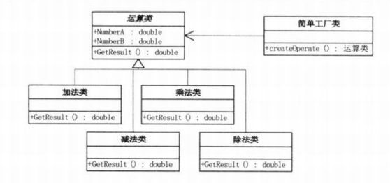
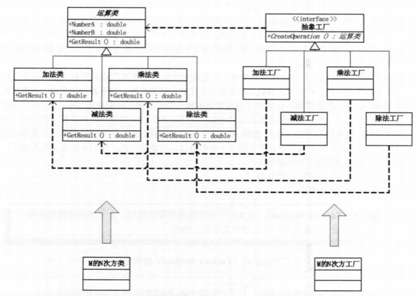
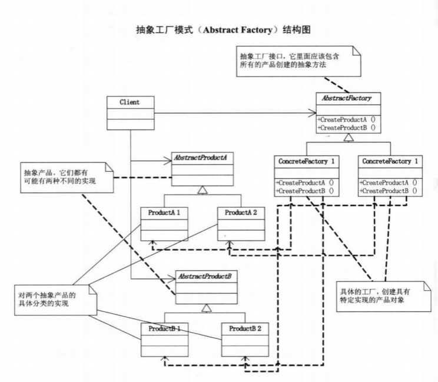

#工厂模式

常用的工厂模式分为三种：

  * 简单工厂模式

  * 工厂方法模式

  * 抽象工厂模式

####简单工厂模式

优点：工厂类包含了必要的逻辑判断，根据客户端的选择条件动态实例化相关的类。对于客户端来说，除去了与具体产品的依赖。
缺点：如果要新增一个功能“求M的N次方”，我们需要给工厂类的方法里面加"Case"分支，这导致**对修改开放**，违背了**开放-封闭原则**

####工厂方法模式

优点：增加新功能时，不需要修改原有的工厂类，只需要增加相应功能的运算类和相应的工厂类。

####抽象工厂模式

优点：
* 易于交换产品系列，具体工厂在一个应用中只需要在初始化的时候出现一次。所以只需要改变具体的工厂即可产生不同的产品。
* 让创建实例的过程与客户端分离，客户端通过它们的接口操纵实例，产品的具体类名也被具体工厂的实现分离。

缺点：
* 要增加一个新系列，需要增加和改动的类过多。而且当很多代码使用了AbstractFactory factory = new  ConcreteFactory1； 这样的句子，要改成= new  ConcreteFactory2 就需要大批量的改动。不满足改动一处，就完全更改的要求。

---
参考：
* 《大话设计模式》
* [大话设计模式C++实现代码](https://github.com/yogykwan/design-patterns-cpp)